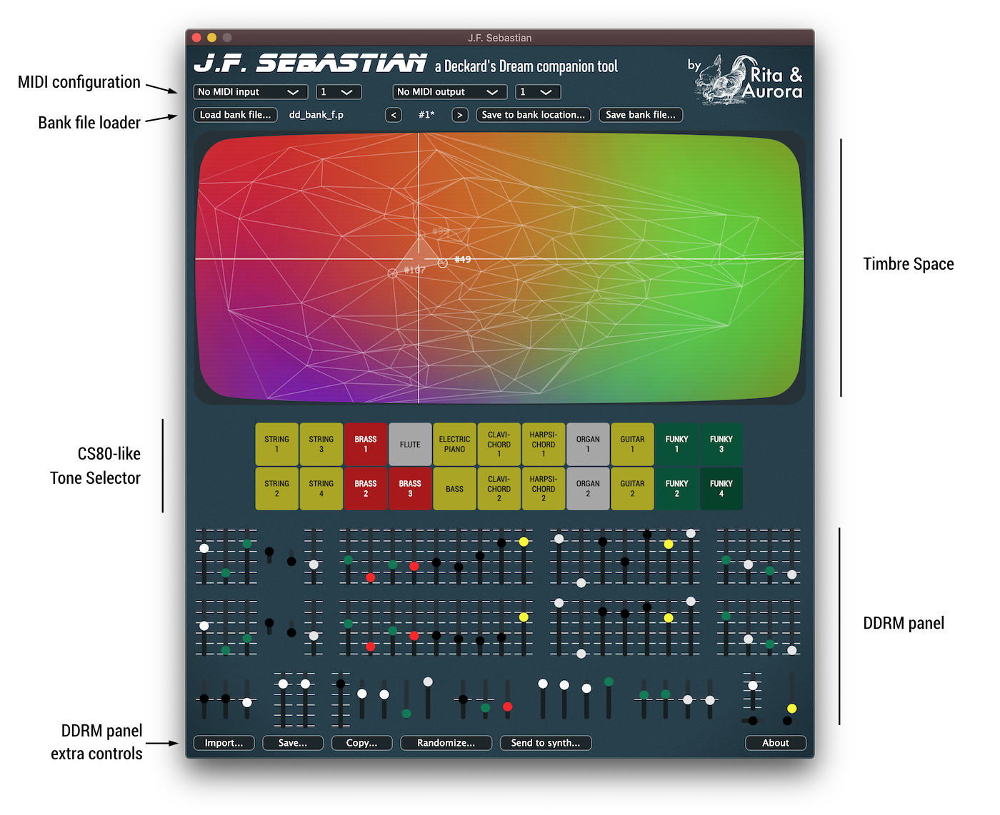
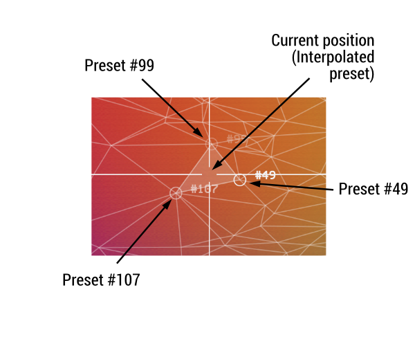
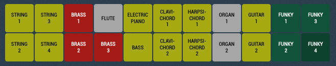
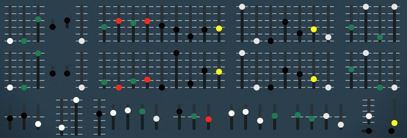

# J.F. Sebastian - User Manual

## 1. Overview

J. F. Sebastian, named after a former [genetic designer](https://bladerunner.fandom.com/wiki/J.F._Sebastian) of the [Tyrell Corporation](https://bladerunner.fandom.com/wiki/Tyrell_Corporation), provides new ways to control and explore the sonic possibilities of the [Deckard's Dream](https://www.deckardsdream.com) synthesiser (DDRM). It works both as a **stand-alone app** and as an **audio plug-in**.

The DDRM is an awesome synthetizer designed by [Black Corporation](http://black-corporation.com) in Japan and inpired by the all mighty [Yamaha CS80](https://reverbmachine.com/blog/exploring-the-yamaha-cs-80). If you're reading this... you most probably know all about it :)

J.F. Sebastian interfaces with the DDRM and turns its sliders into audio plugin parameters that can be *modulated and automated* from your DAW. With J.F. Sebastian you can import DDRM bank files, edit patches and export them. When you import a bank file, a *Timbre Space* will be created which will allow you to navigate all the presets in a colorful space and create new ones. J.F. Sebastian also includes a *CS80-like tone selector* that allows you to use the original presetting system of the CS80 in the DDRM.

Here is a screenshot of J.F. Sebastian with the different parts of the interface highlighted. The sections below describe each one of them.

## 2. Using J.F. Sebastian

### 2.1 Loading J.F. Sebastian as an audio plugin

J.F. Sebastian can run as a **stand-alone application** or as an **audio plugin** inside your DAW. When running as an audio plugin it works as an **audio effect** but effectively acts as a *bypass effect* for all the audio received in the input (i.e. it passes the input audio to the output and leaves it unaffected). The typical setup is to create a *MIDI/external instrument* track in your DAW which routes MIDI to the DDRM and receives the audio signal from DDRM. In that track J.F. Sebastian can be placed as an effect.

The good side of loading J.F. Sebastian as a plugin is that it allows the DAW to control DDRM's parameters, enabling **parameter automtation** and any other sort of **modulation capabilities** offered by the DAW.

### 2.2 MIDI configuration

J.F. Sebastian communicates with DDRM over MIDI. When loaded as an audio plugin it acts as an intermediary between the DAW and DDRM, exposing DDRM sliders as audio parameters of the plugin and then modifying them accordingly using MIDI *control change* messages.

The MIDI configuration section includes dropdowns for configuring the MIDI **input/output devices** as well the **MIDI channels** to communicate with DDRM. Note that when loaded as a plugin, J.F. Sebastian's MIDI configuration is **completely independent from the DAW MIDI configuration** of the channel where J.F. Sebastian is loaded. Therefore in bypasses the MIDI in/out of the channel and only sends/receives from its own devices and channels.

#### 2.2.1 MIDI input

MIDI input is used to receive MIDI data from the DDRM which allows to update the slider values when sliders are moved in the real hardware unit. **MIDI input configuration is optional** as J.F. Sebastian can opererate without it.

To configure MIDI input please select the device from the dropdown menu to which DDRM is sending messages. If your DDRM is connected over USB, you should see a device named **Deckard's Dream**. You also need to select the MIDI channel where DDRM sends the messages.

#### 2.2.2 MIDI output

MIDI output is used to send MIDI data to the DDRM and control its sliders *remotely*. **MIDI output configuration is mandatory** as otherwise J.F. Sebastian has no way to communicate with the DDRM.

To configure MIDI output please select the device from the dropdown menu that will send messages to DDRM. If your DDRM is connected over USB, you should see a device named **Deckard's Dream**. You also need to select the MIDI channel where DDRM is listening.

Note that J.F. Sebastian only sends MIDI *control change* messages to the DDRM and does not handle any other kind of MIDI data. To send *note on/off* messages to the DDRM you need to configure the routing independently of J.F. Sebastian.

### 2.3 Bank file loader

#### 2.3.1 Loading a bank file

Use the `Load bank file...` button to load a DDRM bank file (file extension *.p*). Bank files contain up to 128 presets. Once loaded, you can use the left and right arrow buttons to navigate among the existing presets. You can also type the preset number you want to go to by clicking on the preset number. By default, J.F. Sebastian loads the official **factory presets** provided by Black Corporation.

When a bank file is loaded, a new Timbre Space is built based on all the presets contained in the bank (more info in [Section 2.4](TODO:link)).

When navigating the different presets of a bank, you'll see how both the sliders on the screen and the sound of the DDRM change according to the selected preset. You'll also see how the selected point in the Timbre Space moves at each preset change. This indicates the point in the Timbre Space that corresponds to the selected preset (more info in [Section 2.4](TODO:link)).

Finally, note that if any parameter changes its value after loading a specific preset, the symbol * apprears next to the preset number to indicate that the sliders are no longer *in sync* with the stored values of that preset.

#### 2.3.2 Saving the current preset to a specific bank location

Use the `Save to bank location...` button to save the current preset (the slider values shown in the DDRM panel in J.F. Sebastian) to another location in the bank. When pressing the button a dialog will appear asking you to introduce the bank location to which the preset should be saved. This operation will overwrite any existing preset information in that location.

#### 2.3.3 Saving the bank file

With J.F. Sebastian it is possible to export all the presets into a new bank file and save it to disk. You can do that by pressing the `Save bank file...` button and specifying the location where the bank file should be saved. If not specified, the file extension *.p* will be automatically added to the filename.

The bank files generated by J.F. Sebastian can be copied to the DDRM drive and DDRM will be able to read them. Note that when loading presets from J.F. Sebastian all non-MIDI-controllable parameters are ignored. However, when loading the bank file directly in DDRM any extra patch settings that might be stored in the file will be loaded as well. Check the [limitations](TODO:link) section of this manual for more information about this issue.

### 2.4 The Timbre Space

The Timbre Space is an innovative feature of J.F. Sebastian that allows to **explore the sonic possibilities of DDRM in completely new ways**. Every time a bank file is loaded, J.F. Sebastian creates a new Timbre Space which projects all the presents of that bank file into a *colorful* 2-dimensional space. **Simply click anywhere in the Timbre Space to generate new presets for DDRM**.

The Timbre Space uses **machine learning** to analyze the distribution of parameters values in a given bank file and to create a 2-dimensional representation of it in which presets are organized according to *some notion of similarity*. Here are some examples of spaces created using different DDRM bank files:

The Timbre Space contains a triangle mesh in which each triangle edge corresponds to the position of one of the bank's presets after its projection into the 2-dimensional space. Clicking on any point in the space will create a new preset based on the 3 presets of the enclosing triangle. **Close points in the Timbre Space are expected to produce similar sounding presets**.

When selecting a point in the space, the preset numbers in which the new preset is based are displayed on screen (see picture above). If any of DDRM controls is changed after a specific point of the Timbre Sopace is loaded, the preset numbers on screen will dissapear to idnicate that the slider values are no longer *in sync* with the values of the selected Timbre Space position.

### 2.5 CS80-like Tone Selector

J.F. Sebastian incorportates a tone selector similar to the one that the original CS80 incorporated. The upper row of the tone selector will affect DDRM's channel I parameters, while the lower row will affect channel II. Only one button per row at a time can be selected. Simply click on the buttons of the upper row and lower row to configure slider positions for channel I and II respectively.

When a button is selected it will be highlighted. However, if any parameter is changed after the button is selected, it will become *unselected* again to indicate that the slider values are no longer *in sync* with the expected values for channel I or channel II button.

Note that `Funky 4` button in the lower row does not work. Maybe there's some dust accumulated which should be cleaned...

### 2.6 DDRM panel

J.F. Sebastian has a *virtual* representation of DDRM's hardware controls in the form of nice rounded sliders. The controls are layed down in the same way as in the hardware unit. Control names are not directly visible on screen, but are shown in a popup when hovering  over the controls with the mouse.

If MIDI output is properly configured, moving the sliders in J.F. Sebastian will control the corresponding sliders in the DDRM hardware unit. Similarly, if MIDI input is properly configured, moving the sliders in the hardware unit will cause the sliders in J.F. Sebastian interface to move.

All sliders and buttons are exposed as **audio parameters** to the DAW, meaning that their movement can be **recorded**, **automated** and **modulated** if the DAW has such capabilities.

Double-clicking the sliders will set them to the center position.

Note that the pannel incorporates two extra controls in the lower-right side - `Sustain time` and `Sustain mode` - which are not in the hardware unit. These are additional MIDI-controllable parameters that are only included as hardware controls in the DDRM expander. 

### 2.7 DDRM panel lower buttons

J.F. Sebastian incorporates a number of features to **edit and manage the slider values** which can be accessed using the buttons below the DDRM sliders. Here is an explanation of what these do:

 * `Import...`: use this button to load a DDRM preset from either a *patch* (preset) file or a *voice* (channel) file. These file types store individual presets and voices respectively (instead of the whole contents of a bank file). *patch* and *voice* files are compatible with [Spektroaudio's DDRM editor](http://spektroaudio.com/deckards-dream-editor) and with [Ando's DDRM editor](https://drive.google.com/file/d/1xMHwV3TBTWAK5WPEw8NV0F6aiztP5ZnF/view?fbclid=IwAR2PQ81T-RIw0eQ8rtDKhi9R42i6s5xhgJjm-TmtUaHYMLSERUbs9Iirk3c) as well. Clicking the button will display a menu with the following options:
   *  `From patch file`: will open a dialog to select the *patch* file you want to load. Patch files have extension *.ddpatch*. Patch files contain parameter settings for both channels of DDRM plus the performance controls section.
   *  `From voice file to channel I/II`: will open a dialog to select the *voice* file you want to load in the chosen channel (I or II). Patch files have extension *.ddvoice*. Voice files contain parameter settings for a single DDRM channel controls.

 * `Save...`: use this button to stote the current DDRM preset into a *patch* file or a *voice* file (see menu option above more more information). Clicking the button will display a menu with the following options:
   *  `To patch file`: will open a dialog in which the filename of the *patch* file to save can be specified. The *patch* file will store both channel settings and the performance controls of the current preset.
   *  `Channel I/II to voice file`: will open a dialog in which the filename of the *voice* file to save can be specified. The *voice* file will store the settings of the selected channel of the current preset.

 * `Copy...`: use this button to copy control settings from DDRM channels. Clicking the button will display a menu with the following options:
   *  `From channel I to channel II`: copy the slider settings from channel I to channel II.
   *  `From channel II to channel I`: copy the slider settings from channel II to channel I.
   *  `Swap channels`: swap slider settings of both channels.

 * `Randomize...`: use this button to add some randomization to the slider values of the current preset. Clicking the button will display a menu with the following options:  
   *  `Patch [5%-100%]`: randmozies all control sliders of both channels plus the performance section with the specified amount (from 5% to 100%) around the current slider values. 100% randomization means a completely new random value for each control.
   *  `Channel I/II [5%-100%]`: : randmozies all control sliders of the selected channel (I or II) with the specified amount (from 5% to 100%) around the current slider values. 100% randomization means a completely new random value for each control.

* `Send to synth...`: use this button to synchronize the DDRM with the slider values of J.F. Sebastian. Note that when navigating presets, using the Timbre Space, the tone selector, or when moving sliders in J.F. Sebastian, DDRM is also updated accordingly and there is no need to *manually* send values to the synth. however, in some occasions it might be useful to re-send all control values to DDRM to make sure it is in sync.  Clicking the button will display a menu with the following options:
   *  `Patch`: send values corresponding to the full preset (both channels and performance section).
   *  `Channel I/II`: send only the values of the selected channel.

## 3. Known bugs and limitations

What follows is a list of known J.F. Sebastian bugs and limitations of the software. Please, for **bug reports** and **feature requests** visit [https://github.com/ritaandaurora/ddrm-jfsebastian/issues](https://github.com/ritaandaurora/ddrm-jfsebastian/issues).

 * J.F. Sebastian uses MIDI to communicate with DDRM and update its parameter values. However, as of formwarte version 1.3.0, **not all parameters in DDRM are currently controllable via MIDI**. All the sliders and buttons in the front panel can be controlled via MIDI, but not other *hidden* parameters like envolpe ranges, etc. What this means in practice is that loading presets from J.F. Sebastian **might not produce the exact same results** than loading them from the bank files copied in DDRM because the hidden controls can't be updated. Hopefully future updates of DDRM firmware will allow full MIDI control so that J.F. Sebastian (and other tools) can be updated accordingly.
 
 * **DDRM firmware does not implement any method for dumping baank or slider values over MIDI**. Therefore, J.F. Sebastian has no way of knowing what's the current slider values in DDRM and displaying them. Hopefully this will be addressed in future DDRM firmware update and J.F. Sebastian updated accordingly :)

 * Communication with DDRM is l**imited to the speed at which MIDI messages can be transmitted**. Automation and modulation of parameters is therefore subject to that. We did some testing and the message trhoughput seems to be quite good, specially using MIDI over USB, but still that could be a limitation for vey fast modulations.

 * DDRM is very sensitive to MIDI in-out loops and MIDI control might not work properly if the messages that DDRM sends are put back into its input. J.F. Sebastian avoid creating such loops when both MIDI input and MIDI output are configured, but it can easily happen (it indeed happened to me!) that a feedback loop is created inadvertedly in the DAW. If you observe strange behaviour in J.F. Sebastian controlling DDRM (specially if some buttons in the tone selector section do not seem to work), **make sure you have not accidentally created a MIDI feedback loop**.   

 * When using J.F. Sebastian in stand-alone mode, it could happen that a **warning is displayed about potential audio feedback loops**. This is can be solved by clicking on the `Settings...` button that will appear in the warning and unticking the *Mute audio input* checkbox. J.F. Sebastian will remember this choice so the warning is not displayed again. This is a bug that will be addressed in future updates of J.F. Sebastian as J.F. Sebastian uses no audio and the warning should never appear.

## 4. Licensing

J.F. Sebastian is released under the **GPLv3** open source software license (see [LICENSE](https://github.com/ritaandaurora/ddrm-jfsebastian/blob/master/LICENSE) file) with the code being available at  [https://github.com/ritaandaurora/ddrm-jfsebastian](https://github.com/ritaandaurora/ddrm-jfsebastian). J.F. Sebastian uses the following open source software libraries: 

 * [tapkee](http://tapkee.lisitsyn.me), available under BSD 3-clause license 
 * [delaunator-cpp](https://github.com/delfrrr/delaunator-cpp), available underMIT license
 * [juce](https://juce.com), available under GPLv3 license 
 
J.F. Sebastian uses some fonts released under open licenses as well:

 * [roboto](https://fonts.google.com/specimen/Roboto), available under Apache 2 license
 * [modenine](https://www.dafont.com/modenine.font), available under custom "freely distributable" license (see license file in `Resources/fonts`)
 * [blade runner](https://www.dafont.com/blade-runner-movie-font.font), tagged as "100% free" font

## 5. Credits and acknowledgements

J.F. Sebastian has been ideated and developed by [Rita & Aurora](https://ritaandaurora.github.io), a sort of fancy branding name I've given to my audio-developer [self](https://ffont.github.io).

Enormous thanks to Paul Shiling for creating the great CS80 presets bank that has been used for the tone selector. Also thanks to Black Corporation for making such a great synth!

