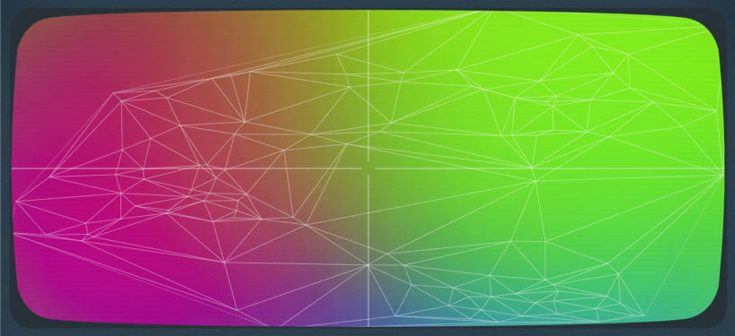

# J.F. Sebastian - User Manual

## Overview

J. F. Sebastian, named after a former genetic designer of the *Tyrell Corporation*, provides new ways to control and explore the sonic possibilities of the CS80-inspired Deckard's Dream synthesiser (DDRM). It works both as a **stand-alone app** and as an **audio plug-in**.

J.F. Sebastian interfaces with the DDRM and turns its sliders into audio plugin parameters that can be *modulated and automated* from your DAW. With J.F. Sebastian you can import DDRM bank files, edit patches and export them. When you import a bank file, a *timbre Space* will be created which will allow you to navigate all the presets in a colorful space and create new ones. J.F. Sebastian also includes a *CS80-like tone selector* that allows you to use the original presetting system of the CS80 in the DDRM.

Here is a screenshot of J.F. Sebastian with the different parts of the interface highlighted. The sections below describe each one of them.

## Using J.F. Sebastian

### MIDI configuration

### Bank file loader

### The Timbre Space

### CS80-like Tone Selector

 Simply click on the buttons of the upper row and lower row to configure slider positions for channel I and II respectively.

### DDRM panel

### DDRM panel extra controls

## Limitations

## Licensing

J.F. Sebastian is released under the **GPLv3** open source software license (see LICENSE file). J.F. Sebastian uses the following open source software libraries: 

 * [tapkee](http://tapkee.lisitsyn.me), available under BSD 3-clause license 
 * [delaunator-cpp](https://github.com/delfrrr/delaunator-cpp), available underMIT license
 * [juce](https://juce.com), available under GPLv3 license 
 
J.F. Sebastian uses some fonts released under open licenses as well:

 * [roboto](https://fonts.google.com/specimen/Roboto), available under Apache 2 license
 * [modenine](https://www.dafont.com/modenine.font), available under custom "freely distributable" license (see license file in `Resources/fonts`)
 * [blade runner](https://www.dafont.com/blade-runner-movie-font.font), tagged as "100% free" font

## Credits and acknowledgements

J.F. Sebastian has been ideated and developed by [Rita & Aurora](), a sort of fancy branding name I've given to my audio-developer [self](https://ffont.github.io).

Enormous thanks to Paul Shiling for creating the great CS80 presets bank that has been used for the tone selector. Also thanks to Black Corporation for making such a great synth!

