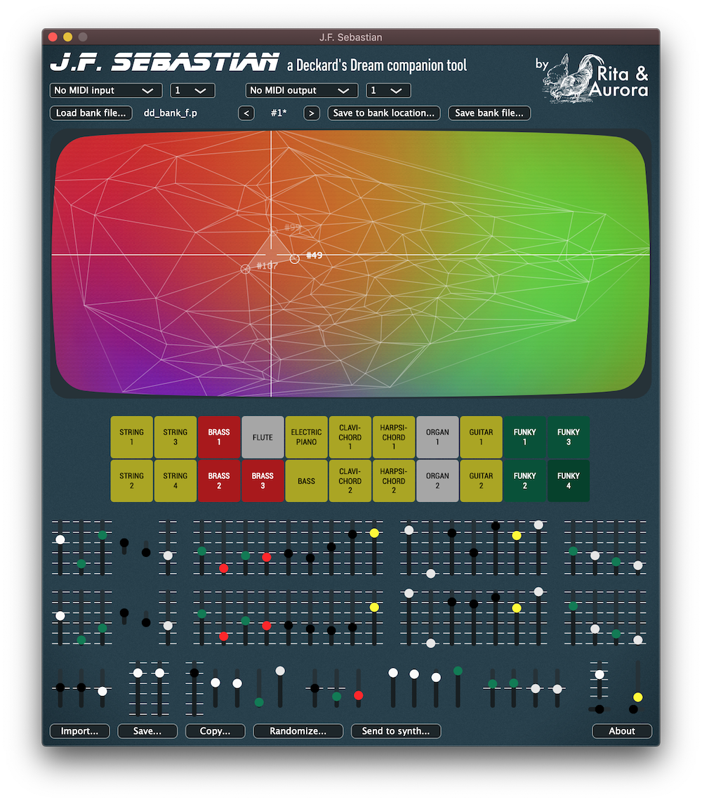
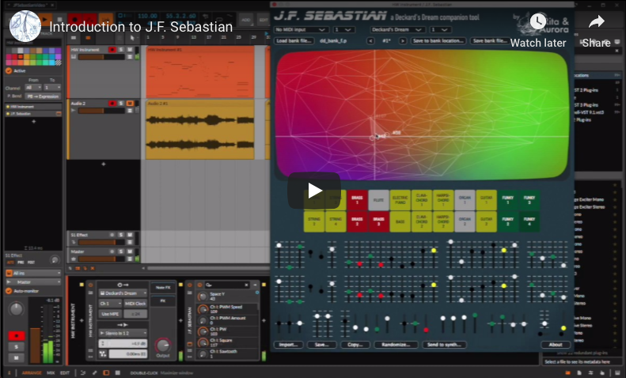
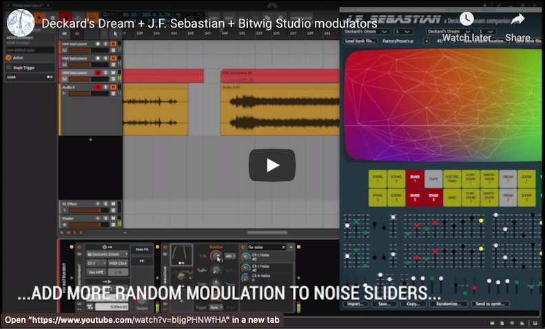

# J.F. Sebastian, a Deckard's Dream companion tool



## Overview

J. F. Sebastian, named after a former genetic designer of the *Tyrell Corporation*, provides new ways to control and explore the sonic possibilities of the CS80-inspired Deckard's Dream synthesiser (DDRM). It works both as a **stand-alone app** and as an **audio plug-in** with automatable parameters.

With J.F. Sebastian you can import DDRM bank files, edit patches and export them. When you import a bank file, a *timbre Space* will be created which will allow you to navigate all the presets in a colorful space and create new ones. Just click anywhere on the timbre Space and play the synth. Click on another point to get a new preset. Close points in the space will result in similar sounding presets.

J.F. Sebastian also includes a *CS80-like tone selector* that allows you to use the original presetting system of the CS80 in the DDRM. Simply click on the buttons of the upper row and lower row to configure slider positions for channel I and II respectively.

Check out [J.F. Sebatian's website](https://ritaandaurora.github.io/ddrm-jfsebastian/) for more information.

Check out the video below for an introduction to J.F. Sebastian and its features:

[](https://www.youtube.com/watch?v=cHdO393UwKI)

Also check out this video that demonstrates the power of J.F. Sebastian in combination with [Bitwig Studio](https://bitwig.com)'s modulators:

[](https://www.youtube.com/watch?v=bIjgPHNWfHA)


## Download

You'll find download links in the [J.F. Sebastian website](https://ritaandaurora.github.io/ddrm-jfsebastian/) and also in the [Releases](https://github.com/RitaAndAurora/ddrm-jfsebastian/releases) section of this code repository. Don't hesitate to report bugs or make suggestions using the tools in the [issues section](https://github.com/RitaAndAurora/ddrm-jfsebastian/issues).


## Help

Please check the [user manual](MANUAL.md) for an explanation of the different features of J.F. Sebastian  and how to use it.


## Build instructions (for developers)

J.F. Sebastian is implemented as a JUCE audio plug-in/standalone app and can be edited and built using standard JUCE workflows. To build J.F. Sebastian you need to

1) checktout the code repository including submodules;

```
git clone https://github.com/RitaAndAurora/kijimi-babu-frik.git && cd kijimi-babu-frik.git && git submodule update --init
```

2) open the project files  for *XCode* (macOS) and *Visual Studio 2019* (windows) you'll find in the `Builds/` folder and compile the projects there.

For advanced development options you'll need to open the `JFSebastian.jucer` using JUCE's Projucer, but this is not needed for basic edits and/or building J.F. Sebastian. Note that if you go that way you'll need a Projucer version which is compatible with J.F. Sebastian. The best way to go is to compile Projucer from the JUCE submodule in the code repository (i.e. use project files in `3rdParty/JUCE/extras/Projucer/Builds/`). 

Note that to build VST2 version of the J.F. Sebastian wou'll need to have the VST2 SDK files and you'll need to edit `JFSebastian.jucer` with the location of your VST2 SDK.


## License

J.F. Sebastian is released under the **GPLv3** open source software license (see [LICENSE](https://github.com/ritaandaurora/ddrm-jfsebastian/blob/master/LICENSE) file) with the code being available at  [https://github.com/ritaandaurora/ddrm-jfsebastian](https://github.com/ritaandaurora/ddrm-jfsebastian). J.F. Sebastian uses the following open source software libraries: 

 * [tapkee](http://tapkee.lisitsyn.me), available under BSD 3-clause license 
 * [delaunator-cpp](https://github.com/delfrrr/delaunator-cpp), available underMIT license
 * [juce](https://juce.com), available under GPLv3 license 
 
J.F. Sebastian uses some fonts released under open licenses as well:

 * [roboto](https://fonts.google.com/specimen/Roboto), available under Apache 2 license
 * [modenine](https://www.dafont.com/modenine.font), available under custom "freely distributable" license (see license file in `Resources/fonts`)
 * [blade runner](https://www.dafont.com/blade-runner-movie-font.font), tagged as "100% free" font
 
## Support J.F. Sebastian development

If you want to support the development of J.F. Sebastian and similar tools you can consider [making a donation](https://ritaandaurora.github.io/ddrm-jfsebastian/donate). That will make me very happy :)


## Credits and acknowledgements

J.F. Sebastian has been ideated and developed by [Rita & Aurora](https://ritaandaurora.github.io), a sort of fancy branding name I've given to my audio-developer [self](https://ffont.github.io).

Enormous thanks to Paul Shilling for creating the great CS80 presets bank that has been used for the tone selector. Also thanks to Black Corporation for making such a great synth!

<p align="center">
<a href="https://ritaandaurora.github.io"></a>
</p>
